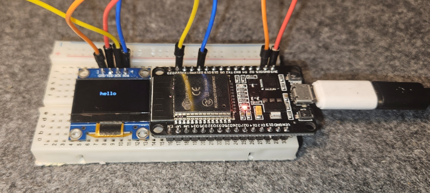
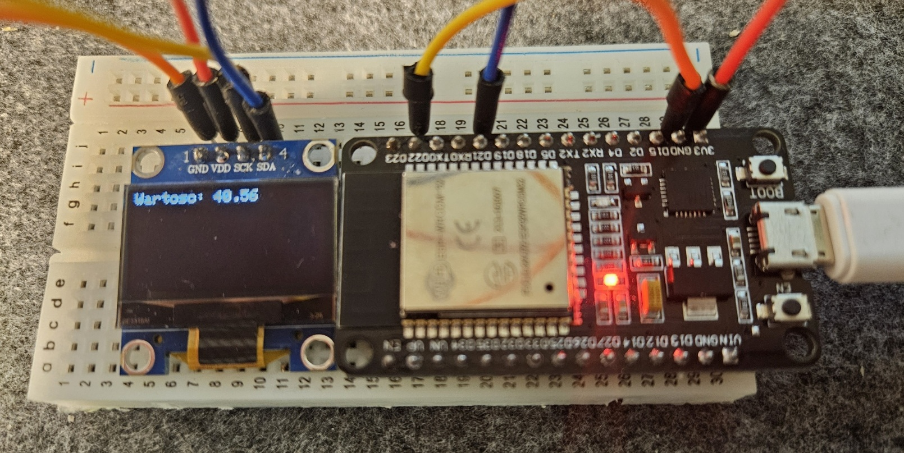

# telemetry-display-receiver
MQTT telemetry sub with display feature  
Date: 01-02-2025  

Simple display with microcontroller.    
In my case I have used esp32 alongside tiny OLED display.  
Receiver catches my MQTT publications from telemetry topics.   

Pin connection setup:  
- (display) GND -> GND (ESP32)  
- (display) VDD -> 3.3V (ESP32)  
- (display) SCK(scl) -> GPIO 22 (d22) (ESP32) (default scl pin)  
- (display) SDA -> GPIO 21 (d21) (ESP32) (default sda pin)  

Please don't mind cable colors   
  

Make sure to set up your [MQTT server](https://mosquitto.org/)  

Demo: 
  

ESP connects to local wifi and mqtt server and displays received current temperature value from my furnance.  

Useful links:  
- [Adafruit_GFX Lib](https://github.com/adafruit/Adafruit-GFX-Library)
- [Adafruit_SSD1306 Lib](https://github.com/adafruit/Adafruit_SSD1306)
- [WiFi Lib](https://github.com/espressif/arduino-esp32/tree/master/libraries/WiFi)
- [PubSubClient Lib](https://pubsubclient.knolleary.net)
